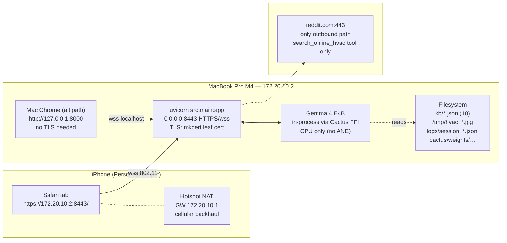
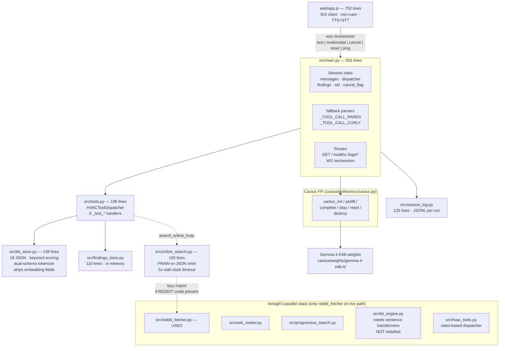
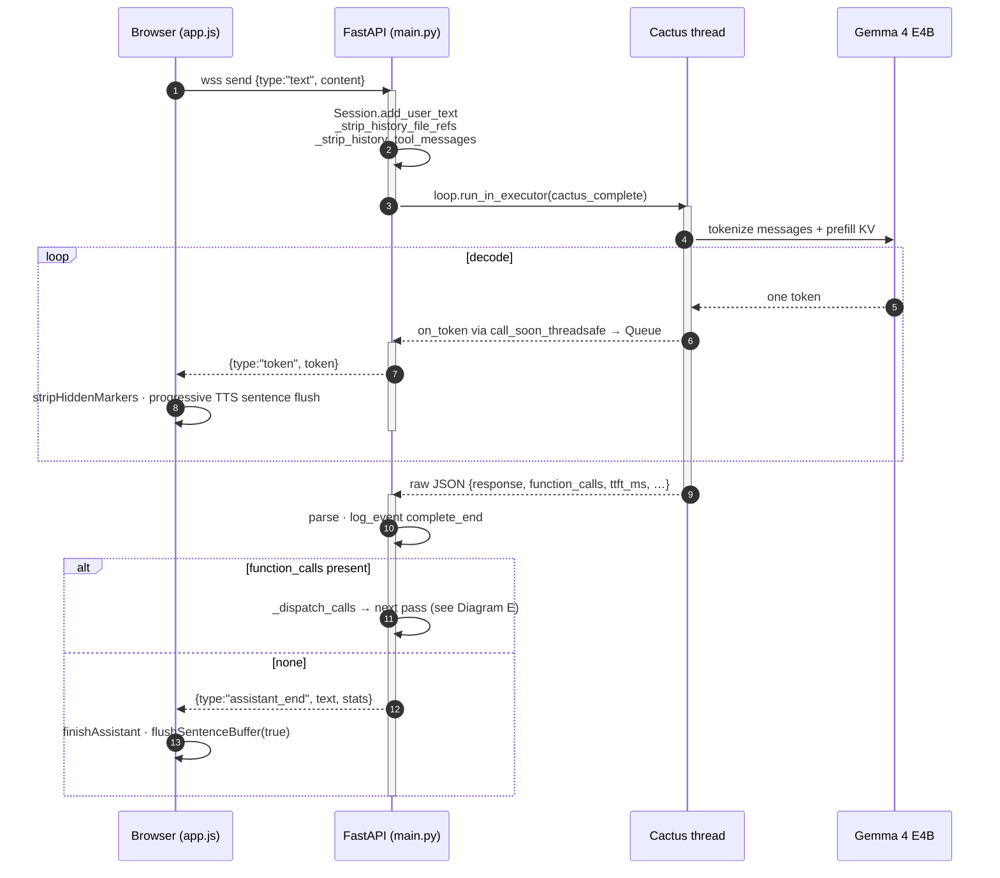
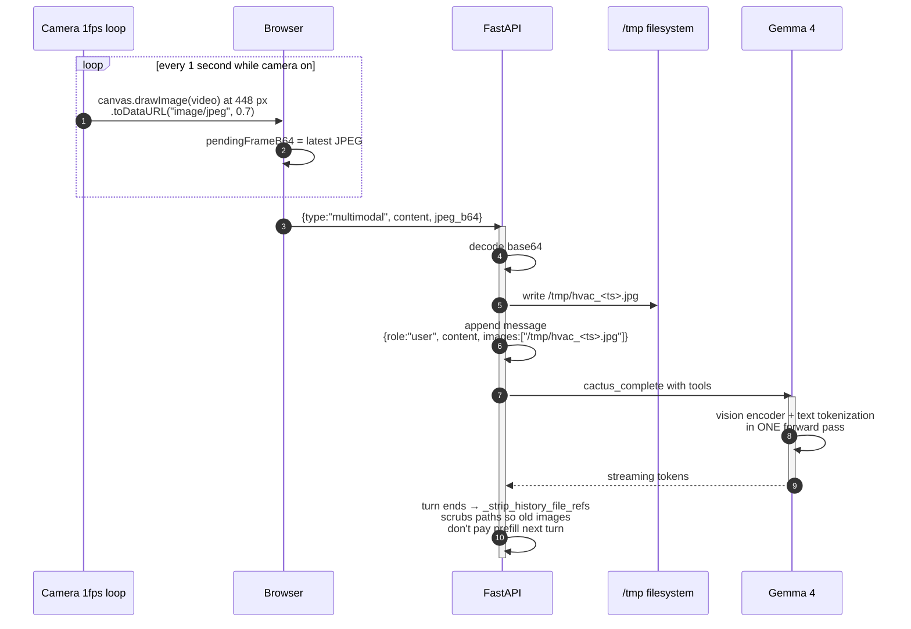
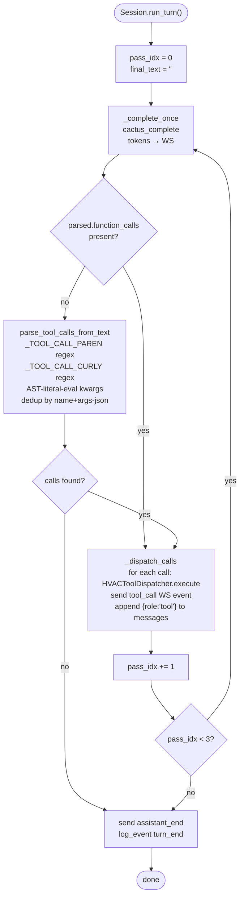
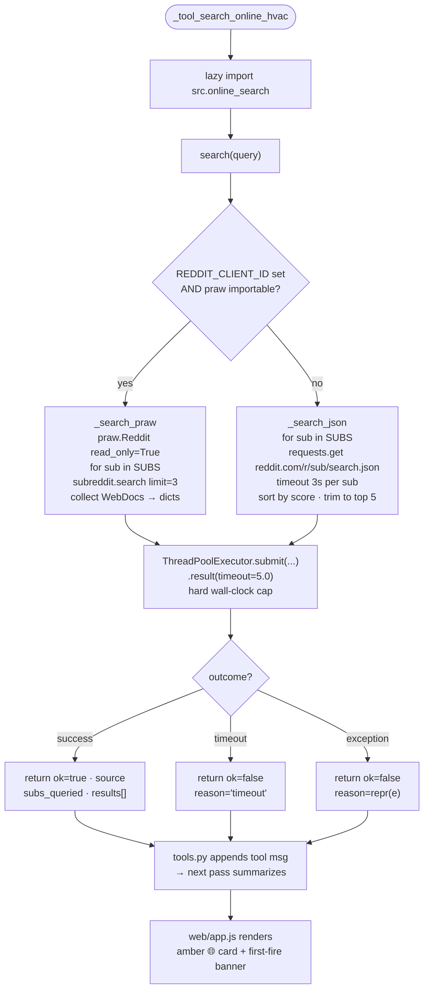
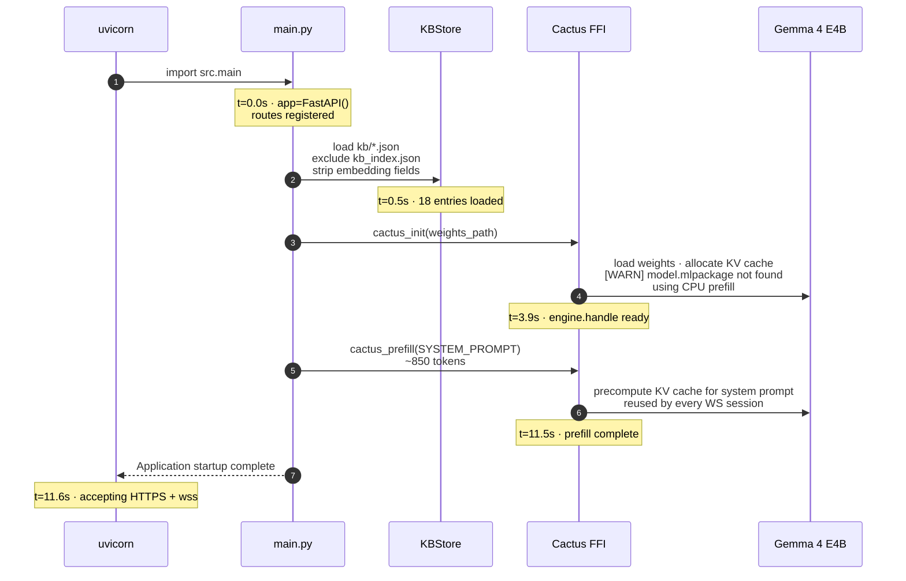
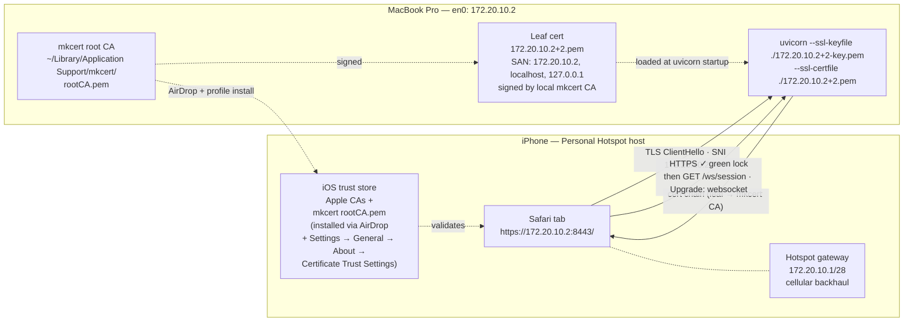

# HVAC Copilot — Architecture

Companion to [HANDOFF.md](../HANDOFF.md). HANDOFF.md is the pickup doc; this is the *why-it's-shaped-this-way* doc. Every claim here maps to a file, command, commit, or measured number.

Eight Mermaid diagrams render natively on GitHub. Read top-to-bottom for full context, or jump to a diagram for one subsystem.

---

## 0. The 30-second mental model

**HVAC Copilot is a FastAPI server running on a Mac, wrapping Cactus Python which wraps a CPU-resident Gemma 4 E4B model.** A browser (Chrome on Mac or Safari on iPhone over a personal hotspot) connects via WebSocket, sends text or text+image, receives streamed tokens. The model calls six tools: five are local (KB search, finding log, safety, scope, close), one is a network escalation to Reddit forums. All voice I/O happens browser-side via Web Speech API — zero audio crosses the WebSocket. This is a deliberate split: Gemma 4 is CPU-bound at ~7 ms/prefill-token on M4 Pro, so we don't add server-side STT/TTS latency on top.

---

## Diagram A — Deployment topology

**Why this shape.** iPhone hotspot beats venue wifi: AP client-isolation on conference wifi usually blocks Mac↔iPhone direct traffic. The hotspot puts both devices on a private 2-device LAN the iPhone itself NATs out. HTTPS is required for `getUserMedia` and `wss://` on non-localhost origins; mkcert gives a locally-trusted cert in ~2 min setup. Single uvicorn process, single Gemma 4 handle — the `engine.lock` inside `src/main.py` serializes Cactus calls across sessions anyway, so multi-process buys us nothing.

---

## Diagram B — Component map (who imports whom)

**Legend.** Solid arrows are synchronous imports + runtime calls. Dotted arrows are lazy or optional. Boxes inside **Parallel** are merged but, with the single exception of `reddit_fetcher.py`, have zero callers on the hot path. Boxes inside **CactusFFI** come from the `cactus/` submodule (external dep, gitignored).

---

## Diagram C — One text-only turn (sequence)

**Key detail.** `on_token` runs on a Cactus C thread, not the asyncio loop. [src/main.py:521](../src/main.py#L521) uses `loop.call_soon_threadsafe(token_queue.put_nowait, tok)` to hand the token across threads. The event loop polls `token_queue.get()` with a 50 ms timeout (main.py:551) and ships each token over WS.

---

## Diagram D — Multimodal turn (text + camera frame)

**Why file paths instead of inline base64 content blocks.** Both work in Cactus. File-path form matches the canonical Cactus Python README and keeps JSON messages small. Inline data-URLs balloon history entries and slow the JSON decoder on every subsequent turn the image remains. [src/main.py:462](../src/main.py#L462) `_strip_history_file_refs` is the cleanup hook.

**Why 448 px.** 224 px was too coarse to OCR real product labels ("MOVINCOOL CLIMATE PRO X14"). Bumped in commit `9885542`. Costs ~1 s extra TTFT per multimodal turn (~256 → ~500 vision tokens).

---

## Diagram E — Three-pass tool loop + fallback parsers

**Why two regex patterns.** Gemma 4's tool-call emission isn't deterministic. Both `query_kb(query="...")` (paren form) and `query_kb{query: "..."}` (curly form) appear in the wild. Cactus's C-side parser handles sentinel + paren; curly falls through as plain text. Patterns at [src/main.py:91](../src/main.py#L91) and [src/main.py:100](../src/main.py#L100). Dedup by `(name, args-json)` prevents double-firing when both forms match the same call.

**Why 3 passes max.** Pass 1: initial `query_kb`. Pass 2: model summarizes KB result. Pass 3: safety net if model chains `log_finding` or `close_job`. Higher caps would let pathological loops burn seconds.

---

## Diagram F — Online escalation branch

**Why the hybrid shim, not pure PRAW.** Reddit discontinued self-service API keys in November 2025 (Responsible Builder Policy). New dev accounts need ~7-day manual review. JSON endpoint `reddit.com/r//search.json` is still public, anonymous, no auth — 60 req/hour per IP. Our demo uses 1–5 calls. PRAW path auto-promotes the moment creds land in `.env`.

**Why wall-clock timeout via `ThreadPoolExecutor`.** `requests.get(timeout=3.0)` is a per-connection timeout, not wall-clock. A stalled DNS resolution or hung socket can blow past it. `concurrent.futures.ThreadPoolExecutor(...).submit(...).result(timeout=5.0)` gives a hard wall-clock kill; the worker keeps running but the tool returns `{ok: false, reason: "timeout"}` and the model moves on.

---

## Diagram G — Startup sequence

**Why prefill the system prompt at boot.** The system prompt is ~850 tokens of rules + 6-tool triggers. Without prefill, every new WS session pays that cost as ~6 s of added TTFT on turn 1. `cactus_prefill` runs once; the KV cache is reused across sessions. Cost: ~7.6 s at boot, amortized across all future turns. Net win: predictable sub-5 s turn-1 TTFT.

---

## Diagram H — iPhone hotspot + TLS chain

**Why mkcert, not Let's Encrypt.** LE requires a publicly-resolvable FQDN. `172.20.10.2` is private RFC1918. mkcert generates a local root CA and signs leaf certs for arbitrary hostnames/IPs, then you install the root CA into each device's trust store.

**Why the trust profile is mandatory on iOS.** Safari's `getUserMedia` for camera + mic requires HTTPS on non-localhost. Untrusted self-signed → Safari blocks silently. With `rootCA.pem` installed and toggled on in Certificate Trust Settings, Safari shows the green lock and allows mic/camera prompts.

---

## Tech stack

| Layer | Technology | Version | Where | Why |
|-------|------------|---------|-------|-----|
| OS | macOS (Darwin 25.3.0) | — | Mac host | M4 Pro dev machine. |
| Python | CPython | 3.12.13 (`cactus/venv`) | all `.py` | Cactus Python was built against this. |
| Web framework | FastAPI | 0.136.0 | [src/main.py](../src/main.py) | Async WebSocket + DI + auto OpenAPI. |
| ASGI server | uvicorn | 0.44.0 (+standard extras) | runtime | Industry default for FastAPI; supports `--ssl-*` flags. |
| WebSocket | websockets | 16.0 | via uvicorn[standard] | — |
| ASGI primitives | starlette | 1.0.0 | transitive | WebSocket + StaticFiles implementation. |
| TLS (demo) | mkcert | brew latest | `172.20.10.2+2*.pem` | Local cert for iPhone LAN. |
| HTTP client | requests | 2.33.1 | [src/online_search.py](../src/online_search.py) | Anonymous Reddit JSON fallback. |
| Reddit client | praw | 7.8.1 | [src/reddit_fetcher.py](../src/reddit_fetcher.py) | Optional upgrade when creds present. |
| LLM runtime | Cactus Python | repo-local build | `cactus/python/src/cactus.py` | On-device vision+audio+text+tools in one pass. |
| LLM | Google Gemma 4 E4B-it | instruct variant | `cactus/weights/gemma-4-e4b-it/` | Effective 4B params, strong multimodal encoder. |
| Device | CPU | — | M4 Pro | No ANE `.mlpackage` shipped for E4B transformer yet. |
| KB storage | JSON files on disk | — | `kb/*.json` (18 files) | 18 entries; zero-dep keyword search is <1 ms. |
| Session storage | in-memory dataclasses | — | `FindingsStore` | Demo has no persistence need. Reset on restart. |
| Observability | JSONL file | — | `logs/session_<ts>_<pid>.jsonl` | `tail -f`-friendly, `jq`-parsable, no DB dep. |
| Browser TTS | `SpeechSynthesisUtterance` | browser-native | [web/app.js:179](../web/app.js#L179) | Free, on-device on iOS (Samantha/Evan Enhanced). |
| Browser STT | `webkitSpeechRecognition` | browser-native | [web/app.js:45](../web/app.js#L45) | Same. iOS routes through Siri's local model. |
| Camera capture | Canvas 2D + `toDataURL("image/jpeg", 0.7)` | browser-native | [web/app.js:654](../web/app.js#L654) | No external encoder lib. |
| Sentence segmentation | `Intl.Segmenter` | browser-native (iOS 14.5+) | [web/app.js:134](../web/app.js#L134) | Zero-dep sentence boundaries for progressive TTS. |
| Tests | pytest | 8.x | `tests/` | 65 tests, all green. |

---

## Design decisions

### D1. Mac Python instead of iOS Swift *(context: Diagram A)*
Cactus iOS XCFramework had unresolved link-time and Swift-interop issues at hackathon date. Same Cactus binary runs via Python on Mac cleanly. Pitch preserved: Mac is still the user's own hardware. iOS port later becomes a thin-client swap — replace `app.js` WebSocket with a Cactus Swift SDK call — once the Apple SDK stabilizes. Swift scaffold preserved at `archive/ios-abandoned/`.

### D2. iPhone hotspot instead of venue wifi *(Diagram H)*
YC conference wifi usually enforces AP client-isolation. Mac↔iPhone direct traffic blocked. iPhone Personal Hotspot puts both devices on a private 2-device LAN the iPhone NATs to cellular. Demo traffic is <1 MB; negligible data. Bonus: screen-recording shows no venue wifi involvement.

### D3. Browser-side voice I/O, not server-side *(Diagram C)*
Server-side Whisper STT + cloud TTS would stack 500 ms–2 s onto every turn and kill barge-in responsiveness. Web Speech API is browser-native and free. On iOS Safari STT routes through Siri's local model. Pattern adopted from the Wine_Voice_AI team's notes ("treat Safari as text-first" — we went further, made voice work there via `webkitSpeechRecognition` + auto-restart on `onend`).

### D4. File-path multimodal, not inline base64 *(Diagram D)*
Both work. File-path (`images: ["/tmp/x.jpg"]`) is the canonical Cactus documented shape and keeps message JSON small. Inline data-URL content blocks balloon each history entry. `_strip_history_file_refs` at [src/main.py:462](../src/main.py#L462) scrubs paths after the turn so old images don't pay prefill on future turns.

### D5. Keyword-scored KB, not embedding KB *(Diagram B)*
18 entries. Amogh's `kb_engine.py` with SentenceTransformers MiniLM would cost ~300 MB deps + ~10 s cold-start + ~40 ms/query. Our keyword matching over flat + rich-schema entries is <1 ms, zero cold-start, no dep. `sentence-transformers` is in `requirements.txt` (inherited from the merge) but deliberately NOT installed in the venv.

### D6. JSON fallback primary, PRAW optional *(Diagram F)*
Reddit's Responsible Builder Policy (Nov 2025) retired self-service API keys. PRAW requires approved creds and ~7-day manual review. Anonymous JSON endpoint is public, same data, usable now. PRAW auto-promotes when creds land. Measured: JSON fallback returned 5 real Reddit hits in 814 ms end-to-end.

### D7. 3-pass tool loop *(Diagram E)*
Typical HVAC turn is `query_kb → summarize → [optionally close_job]`. 3 passes covers it without risking runaway loops. Tighter (2) cuts off summarization-after-chain; looser (5+) turns bugs into time-wasters.

### D8. Dual-form tool-call fallback parser *(Diagram E)*
Gemma 4 doesn't always wrap calls in the `<|tool_call_start|>` sentinel; sometimes emits `name(args)` or `name{args}` as plain text. Cactus C-side catches sentinel + paren. We added AST-based paren parsing and a custom curly tokenizer at [src/main.py:129](../src/main.py#L129). Dedup by `(name, args-json)` prevents double-firing.

### D9. Single shared Cactus handle + `engine.lock` *(Diagram B)*
One Gemma 4 model, one KV cache; can't run two completions concurrently on the same handle. `engine.lock: asyncio.Lock` at [src/main.py:537](../src/main.py#L537) serializes `cactus_complete` across sessions. Two sessions = one queue; fine for 1–2-user demo.

### D10. SessionLog as JSONL, not DB *(Diagram B)*
JSONL is append-only, tail-friendly, `jq`-parsable, zero-dep. A SQLite log would need migrations + ORM. Our `tools/analyse_log.py` CLI parses JSONL and prints p50/p90/p95 TTFT. If session volume ever exceeds hackathon scale, move to DuckDB on the same files; no writer change.

---

## Known gaps

Things this architecture *deliberately doesn't cover* — honest list for the next engineer.

1. **Cactus SIGSEGV on mid-stream WS disconnect.** HANDOFF §12 #1. Error path calls `cactus_reset()` which sometimes segfaults during in-flight generation. No try/except guard yet. Proposed fix is ~10 lines.
2. **No backpressure on token queue.** If Gemma 4 decodes faster than the WS ships to a slow client (e.g. laggy iPhone on cell), `token_queue` grows unbounded. Not a problem at ~17 tok/s decode vs ~10 Mbps WS today, but no watermark.
3. **No auth on WS.** Anyone reaching `wss://172.20.10.2:8443/ws/session` can use the model. Private hotspot LAN is the only boundary. Production needs a token.
4. **No rate-limit on `search_online_hvac`.** Reddit anonymous endpoint is ~60/hr/IP. Demo scale is 1–5 calls; production needs a bucket.
5. **`cactus_stop` is best-effort.** The CPU-bound `cactus_complete` in the ThreadPoolExecutor thread can take up to ~200 ms to notice the stop. Tokens streamed in that window still reach the client.
6. **History trimming is aggressive.** Strip tool-role + file refs + cap length. Loses some multi-turn context quality for bounded TTFT. Model occasionally forgets a just-logged finding. Partial fix only.
7. **No vision encoder caching.** Same unit across three turns = three encoder runs. Cactus exposes no per-image cache key.
8. **Parallel Python stacks coexist.** `kb_engine.py` + `hvac_tools.py` + `db.py` are merged but unused. Future refactorers will waste time picking which to trust unless they read HANDOFF §12 #9.
9. **Startup prefill assumes stable system prompt.** If `SYSTEM_PROMPT` changes at runtime, KV cache becomes stale. We don't invalidate. Every change requires a server restart.
10. **Safari Web Speech on iOS is on-device but undocumented.** STT appears to route through Siri's local model; no public Apple guarantee. A future iOS update could change this without telling us.

---

## Cross-references

| Need to change… | Read HANDOFF §X | Then this file |
|-----------------|------------------|----------------|
| How the model is called | §4, §12 | Diagram C + `src/main.py` `_complete_once` |
| Which tools exist | §7 | `shared/hvac_tools.json`, `src/tools.py` |
| Tool dispatch loop | — | Diagram E + `src/main.py` `run_turn` |
| KB data shape | §8 | `src/kb_store.py`, `kb/*.json` |
| How images get in | §5, §9 | Diagram D + `src/main.py` multimodal handler |
| Online search | §7 #6 | Diagram F + `src/online_search.py` |
| Deployment for iPhone | §10, §11 | Diagram H |
| Session logging | §8 | `src/session_log.py`, `tools/analyse_log.py` |
| Known landmines | §12 | this file's "Known gaps" |

---

## Update protocol

This doc goes stale fast. After any commit that changes:
- A tool schema or dispatcher → update Diagram E + D7/D8
- The WS protocol → update Diagrams C/D + HANDOFF §9 cross-ref
- A new dep or version bump → update the Tech stack table
- A new known risk → add to Known gaps here AND HANDOFF §12

If reality and this document disagree, **trust the code** and file a fix here.
